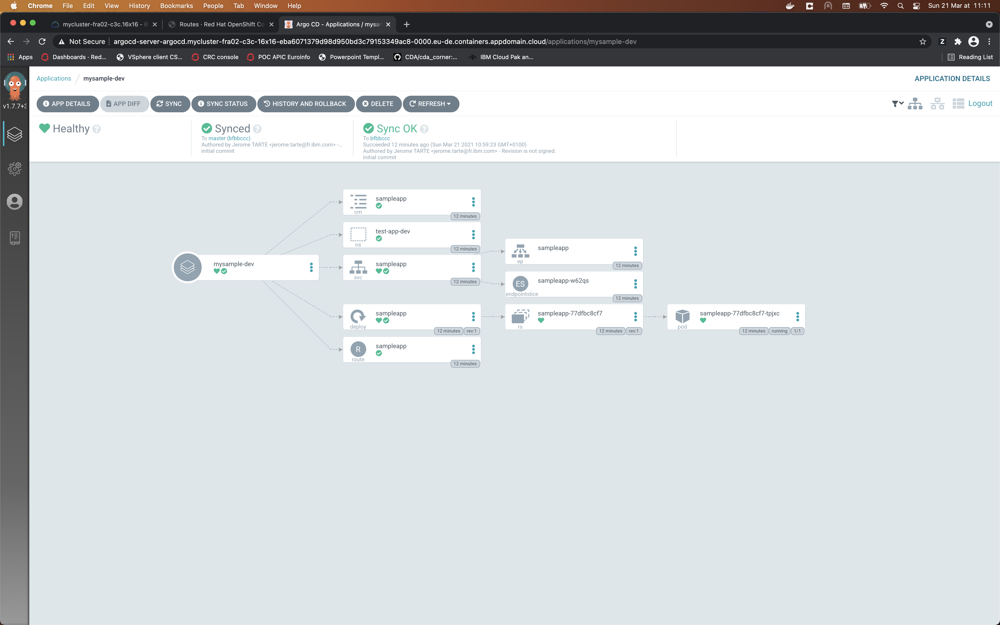
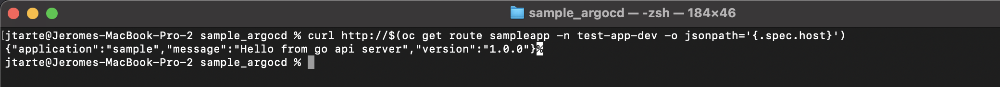
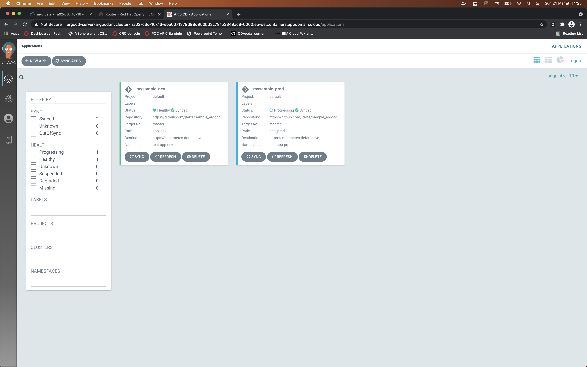
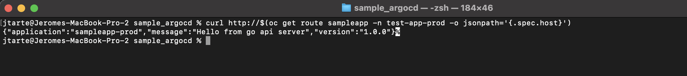

# Samples of application deployment with GitOps

This sample consist to deploy one simple application on two environments:
* dev
* prod

The deployment use a comman base. But each environment has its own configuration for some paramtzers (routes, namespace ...).

The `app_config` directory contains the common base for the deployment. It use a `kustomization.yaml` file to list all the file ahving a role in this deployment.

## Deployment in dev environment

In the `app_dev` directio, there are the files ensuring the deployment of the application. The `application.yaml` defines the ArgoCD appliacation and teh rule to monitor the synchronisation betwen the values in git and what it has been deployed on the cluster.

The `kustomisation.yaml` defines the specific deployment for dev environement. It is based on the common base defien d in the `app_config` dir of the git repo. The it add the specific namespaces. finally, it does some patch on default values to ensure the alignment with the dev environment. Here, it change the host of the route to be aligned with the specific namespace of the dev environment.

To deploy the application in dev environment:
```
oc apply -f app_dev/applications.yaml
```

on ArgoCD, yoi could the how the deployment is managed and what are the resourcees that are monitored to ensure the synchronisation with the confi inside the git reposistory. 



To test the application in the development environment:
```
curl http://$(oc get route sampleapp -n test-app-dev -o jsonpath='{.spec.host}')
```


## Deployment in Prod environment 

The deployment in prod environment works in the same way. 

The specific part are locatated in the `app_prod` directory. The `application.yaml`file defines the prod application managed by ArgoCD. The `kustomization.yaml` precises the specificities of the prod environment (route, value in configmap).

To deploy the application in prod environment:
```
oc apply -f app_prod/applications.yaml
```

You have now two applications in ArgoCD. 



To test the application in the development environment:
```
curl http://$(oc get route sampleapp -n test-app-prod -o jsonpath='{.spec.host}')
```
 

As you could see, the response is different in prod environment from the dev environment. 