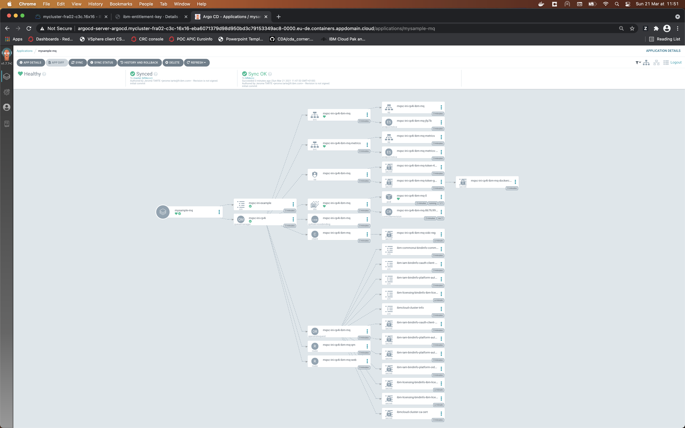

# Deploy an CP4I MQ instance with GitOps

## Define MQ instance
As MQ, like other components of IBM Cloud Pak for Integration, are managed by using CRD, the deployment of MQ instance could be done be using a IaC approch. You have to defined a `QueueMaanger` and apply it to the cluster.

Here is a sample to define a sample queue manager:
```
apiVersion: mq.ibm.com/v1beta1
kind: QueueManager
metadata:
  name: mqsc-ini-cp4i
  labels:
    version: 0.0.2
spec:
  version: 9.2.1.0-r1
  license:
    accept: true
    license: L-RJON-BUVMQX
    use: NonProduction
  web:
    enabled: true
  template:
    pod:
      containers:
        - env:
            - name: MQSNOAUT
              value: 'yes'
          name: qmgr
  queueManager:
    name: "MQSCINI"
    mqsc:
    - configMap:
        name: mqsc-ini-example
        items:
        - example1.mqsc
    storage:
      queueManager:
        type: ephemeral
```

The specific configuration of the queue manager is define inside a configmap tha tis referenced inside the previous file. Here is a sample of queue manager stroed in a config file :
```
apiVersion: v1
kind: ConfigMap
metadata:
  name: mqsc-ini-example
data:
  example1.mqsc: |
    DEFINE QLOCAL('DEV.QUEUE.1') REPLACE
    DEFINE QLOCAL('DEV.QUEUE.2') REPLACE
 ```

## MQ instance deployment maanged by ArgoCD

In the same way than application, the deployment of MQ instance could be managed by ArgoCD.

In the `MQ` directory of the repository, you could find the yaml file to define this deployment. In addition of teh two yaml file mentioned previously, the `kustomozation.yaml` file list the file used for this deployment. The `application.yaml` describes the application that will be managed by ArgoCD. Application used to ensurte the synchornization between the confuurations tored into the git repository and what it has been deployed.

Before the deployment, in this sample case, a namespace `mq-test` has been defined and a secret `ibm-entitlement-key`, in the `mq-test` project, containing the IBM CP4I entitlment key has been created

To deploy the MQ instance:
```
oc apply -f MQ/application.yaml
```

The ArgoCD shows the result of this deployement:



In the MQ Console, you could check that the config you provided in the configmap is present on the deployed queue manager.

